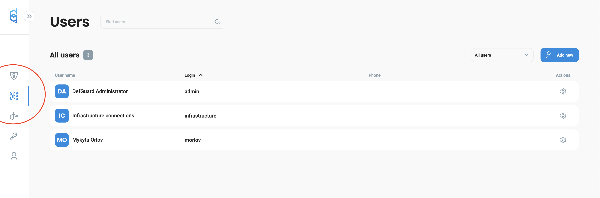
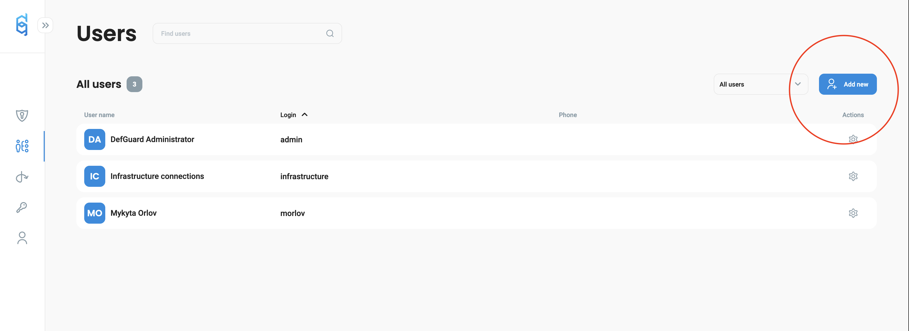
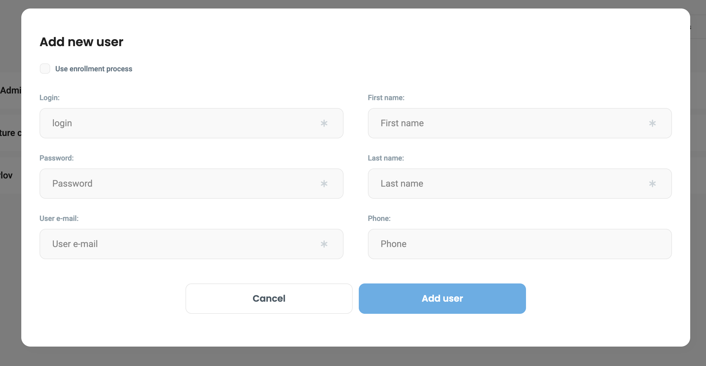
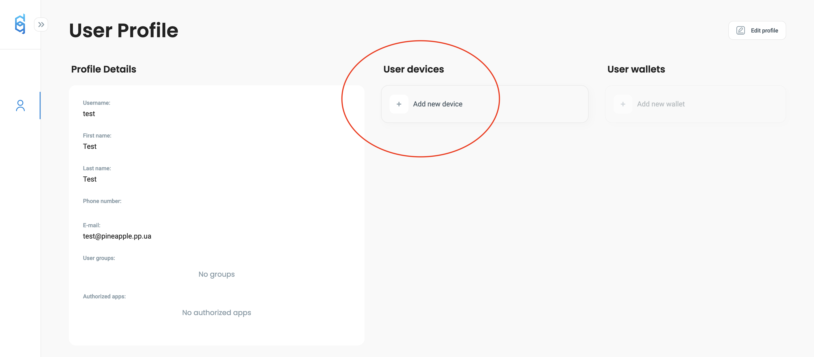
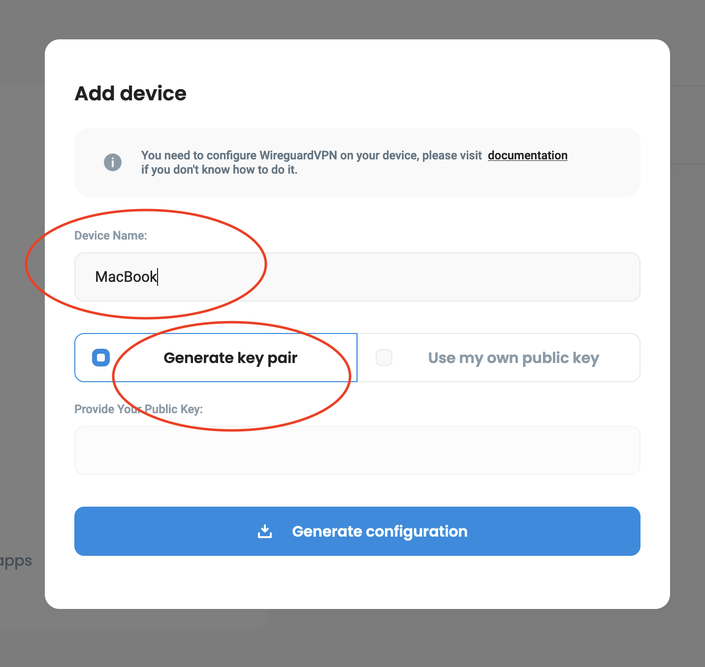
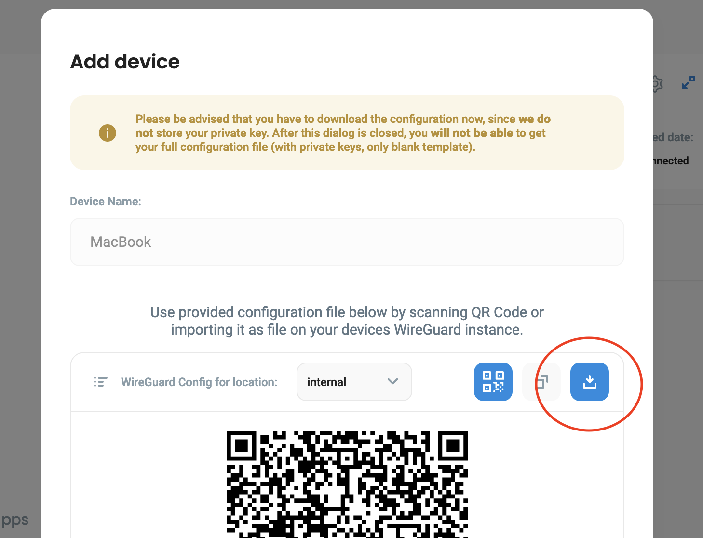
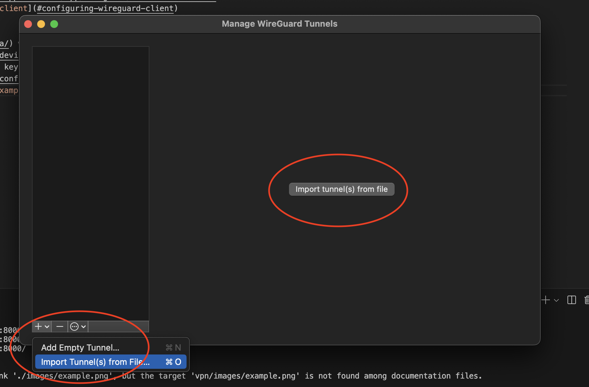
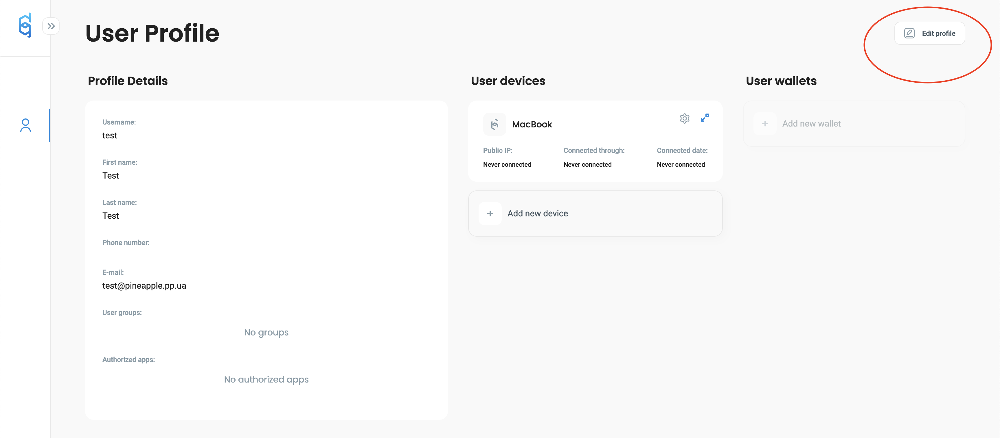
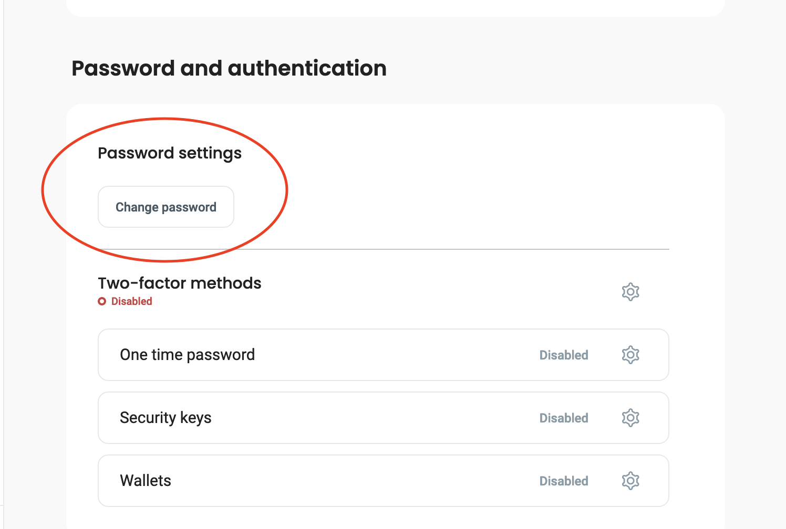

# VPN/SSO configuration

## Onboarding new user
1. Login to [defguard](https://vpn.pineapple.pp.ua/) as admin
2. Navigate to users tab 
3. Click "Add new" 
4. Fill all needed fields , use @pineapple.pp.ua as subdomain for email
5. Provide login/password to user

## Wireguard install on Windows
1. Install wireguard from [https://download.wireguard.com/windows-client/](https://download.wireguard.com/windows-client/)
2. Configure client using [Configuring Wireguard client](#configuring-wireguard-client)

## Wireguard install on macOS
1. Install wireguard from [AppStore](https://apps.apple.com/ru/app/wireguard/id1451685025?mt=12)
2. Configure client using [Configuring Wireguard client](#configuring-wireguard-client)

## Configuring Wireguard client 
1. Login to [defguard](https://vpn.pineapple.pp.ua/) with your credentials
2. Tap add new device 
3. Choose name for your device and pick "Generate key pair" option. Each device must have its own config! 
4. Save configuration to file 
5. Import it in wireguard (example for macOS) 
6. Activate new connection and check if you can access any private resource

## Password change
1. Login to [defguard](https://vpn.pineapple.pp.ua/) with your credentials
2. Tap "Edit profile" 
3. Tap "Change password" 